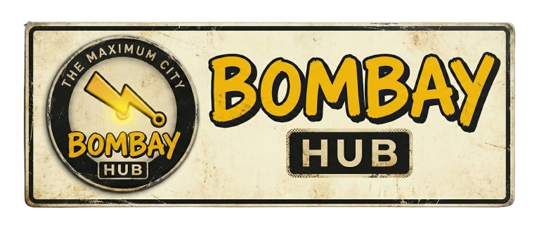

# 🇮🇳 BombayHub: The Spirit of Mumbai

> *Curating the chaos, culture, and charm of the Maximum City.*



**BombayHub** is a digital twin of Mumbai—a hyper-localized, visually immersive platform that captures the pulse of the city. From the silence of the Gateway at dawn to the chaos of the 8:02 Virar Fast, we bring the vibe of Mumbai to your screen.

Built with modern web technologies, it features real-time weather, AQI monitoring (because duh, it's Mumbai), and a curated "Vibe Grid" that explores the city's iconic moods.

---

## ⚡ Features (The Pulse)

### 🌊 The Vibe Grid
A beautifully designed, masonry-style grid that showcases the different faces of Mumbai.
- **Visual Storytelling**: High-quality imagery with glassmorphism tags.
- **Local Context**: "Cutting Chai", "Art Deco", "Monsoon" – cultural touchpoints explained.
- **Immersive Mobile Experience**: Optimized vertical feed for the fast-paced Mumbaikar.

### 🌦️ Live Dashboard
Real-time data for the real-time city.
- **AQI Monitor**: Know exactly how "smoky" the air is today.
- **Weather Metrics**: Humidity, Temperature, and current conditions.
- **Mumbai News**: Latest headlines from local sources to keep you updated.

### 🗺️ The Explorer
- **Interactive Map**: Navigate through the city's noise (Coming Soon).
- **Heritage Walks**: Digital guides to the city's architectural marvels.

---

## 🛠️ The Local Train Compartment (Tech Stack)

Just like a Mumbai Local, this project runs on a robust, high-performance engine.

- **Framework**: [Next.js 16](https://nextjs.org/) (App Router) – Faster than a CST fast train.
- **Styling**: [Tailwind CSS v4](https://tailwindcss.com/) – For that slick, South Bombay look.
- **Animations**: [GSAP](https://gsap.com/) – Smooth transitions, no jerks.
- **Icons**: [Lucide React](https://lucide.dev/) – Clean, minimal, reliable.
- **Smooth Scroll**: [Lenis](https://lenis.darkroom.engineering/) – Buttery smooth scrolling experience.
- **Map**: [Leaflet](https://leafletjs.com/) – Open-source maps for the open city.

---

## 🚀 Getting Started

Want to run this locally? Follow these steps faster than a rickshaw driver taking a shortcut.

### Prerequisites

- Node.js 18+ (The engine)
- npm or pnpm (The fuel)

### Installation

1.  **Clone the Repository**
    ```bash
    git clone https://github.com/yourusername/bombayhub.git
    cd bombayhub
    ```

2.  **Install Dependencies**
    ```bash
    npm install
    # or
    pnpm install
    ```

3.  **Run the Development Server**
    ```bash
    npm run dev
    ```

4.  **Open the Port**
    Visit [http://localhost:3000](http://localhost:3000) and feel the breeze of Marine Drive.

---

## 📂 Project Structure

```bash
bombayhub/
├── app/                  # Next.js App Router (The Stations)
├── components/           # UI Blocks (The Building Blocks)
│   ├── VibeGrid.tsx      # The main visual grid
│   ├── Dashboard.tsx     # Weather/News logic
│   ├── Navbar.tsx        # Navigation with Logo
│   └── Footer.tsx        # Premium footer ("Vada Pav" edition)
├── lib/                  # Utilities (The Cutting Chai)
│   ├── data.ts           # Static content (Vibes list)
│   └── api.ts            # Data fetchers
└── public/               # Static Assets (Images, Icons)
```

---

## ❤️ Credits

- **Design**: Inspired by the chaotic beauty of Mumbai streets and the elegance of Art Deco architecture.
- **Images**: Unsplash (The watchful photographers of the city).
- **Vibe**: Pure 100% Mumbaikar.

---

<p align="center">
  Made with <span style="color: #FFD600;">Vada Pav</span> and Code in Mumbai. 🇮🇳
</p>
